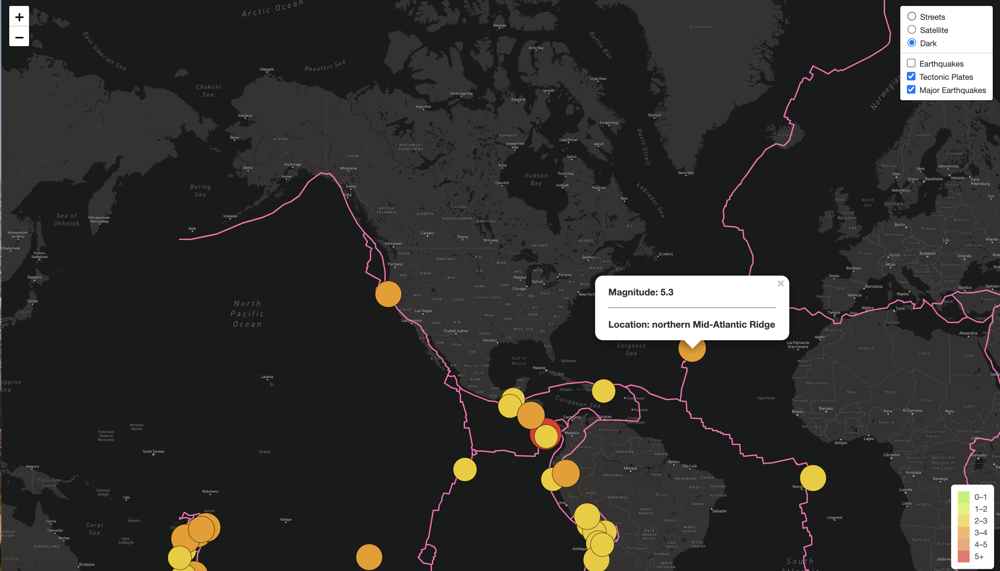

# Overview

In this challenge, major earthquakes data is platted using the **Leaflet** library functions.

Data is read in JSON format using *d3* functions (from external URLs), and then, each object in the array is represented as a layer object in the map (such as a circle). Using Leaflet's functionality, layers can be customized. The map background can be controlled by seleting appropriate themes and a menu option given to the user can allow them to control the theme of their choice.

# Results

All three deliverables are done and the code is checked in the *earthquakes_challenge* folder. Without the Mapbox API key, unfortunately, the site cannot be rendered on the Github Pages. Below are two images taken to show the code functionality.

*Image 1: Major Earthquakes on a Dark Background*

*Image 2: All Earthquakes on a Satellite Background*
